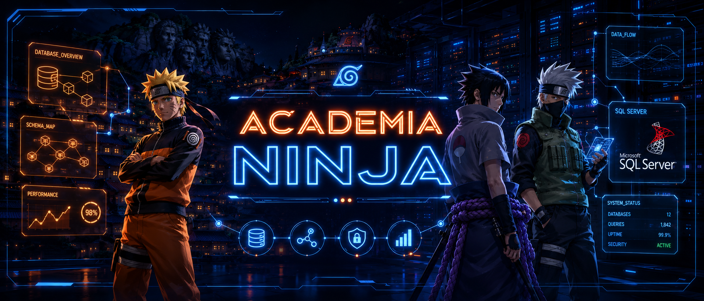

<p align="center">
  
</p>

# 🥷 Academia Ninja — Proyecto Integrador de Base de Datos II

<p align="center">
  
  
  
  
  
</p>

---

## 🍥 De qué se trata esto

Este es el Trabajo Práctico Integrador de la materia **Base de Datos II** de la Tecnicatura Universitaria en Programación (UTN FRGP). La idea era armar una base de datos completa de punta a punta, y para que no fuera el típico ejemplo aburrido de clientes y facturas, la temática la sacamos del universo de **Naruto**.

Academia Ninja es un sistema para gestionar una academia de ninjas: registra a los personajes, los agrupa en aldeas y rangos, los arma en equipos con un sensei a cargo, les asigna misiones según la dificultad y lleva el control de qué técnicas (jutsus) sabe cada uno. Todo eso con la lógica importante metida adentro del motor (vistas, procedimientos y triggers), no afuera.

Lo dejamos público con dos intenciones: que cualquier alumno que esté arrancando con bases de datos pueda mirar cómo está armado y guiarse, y de paso dejar registro de lo que fuimos aprendiendo en la cursada.

---

## 📜 Qué conceptos de la materia se ven acá

Si estás cursando algo parecido, en este repo vas a encontrar ejemplos concretos y funcionando de:

- **Modelo relacional y normalización** hasta tercera forma normal (3FN).
- **Integridad referencial** con claves foráneas, y **claves primarias compuestas** en las tablas intermedias.
- **Relaciones muchos a muchos** resueltas con tablas intermedias.
- **Restricciones** del lado del motor: `PRIMARY KEY`, `UNIQUE`, `CHECK`, `DEFAULT` e `IDENTITY`.
- **Baja lógica** en lugar de borrado físico.
- **Vistas** con distintos tipos de JOIN, `LEFT JOIN` para detectar faltantes y funciones de agregación con `GROUP BY`.
- **Procedimientos almacenados** con transacciones y manejo de errores (`BEGIN TRAN`, `TRY/CATCH`, `THROW`).
- **Triggers** de auditoría y de validación de reglas de negocio, usando las tablas `inserted` y `deleted` y `ROLLBACK`.

---

## 🗺️ El modelo de datos

La base tiene 12 tablas. Las separamos en tres grupos según para qué sirven.

**Tablas de catálogo** (datos fijos de referencia):

| Tabla | Para qué |
|---|---|
| `Aldeas` | Las villas ninja (Konoha, Suna, etc.) con su país. |
| `Rangos` | La jerarquía, de Estudiante hasta Kage, con un nivel de prioridad. |
| `Dificultades` | La clasificación de las misiones por código (D, C, B, A, S). |
| `Elementos` | Las naturalezas de chakra (Fuego, Agua, Rayo, etc.). |

**Tablas principales** (las entidades del negocio):

| Tabla | Para qué |
|---|---|
| `Ninjas` | Los personajes. Cada uno pertenece a una aldea y a un rango. Usa baja lógica con el campo `Estado`. |
| `Jutsus` | Las técnicas. Cada jutsu pertenece a un elemento. |
| `Misiones` | Las misiones, cada una con su dificultad y su recompensa propia. |
| `Equipos` | Las escuadras. Cada equipo tiene un sensei, que a su vez es un ninja. |

**Tablas intermedias y de auditoría:**

| Tabla | Para qué |
|---|---|
| `EquipoDetalle` | Resuelve el N a N entre Equipos y Ninjas (los alumnos de cada equipo). |
| `NinjaHabilidades` | Resuelve el N a N entre Ninjas y Jutsus, guardando el nivel de maestría. |
| `Asignaciones` | Vincula un Equipo con una Misión, con fecha de inicio, fin y estado. |
| `AuditoriaNinjas` | Registra automáticamente las altas, bajas y modificaciones de ninjas. |

### 🌀 El núcleo del sistema

La parte más importante del modelo es cómo se conectan los equipos con las misiones. Un equipo no se relaciona directo con una misión: la relación pasa siempre por una **asignación**. Así, la tabla `Asignaciones` es la que sabe qué equipo está haciendo qué misión, desde cuándo y en qué estado (En Curso, Completada o Fallida). Un ninja, además, puede estar en más de un equipo, y por eso entre `Ninjas` y `Equipos` hay una tabla intermedia (`EquipoDetalle`) en lugar de una FK directa.

El diagrama entidad-relación completo está en el archivo `Mapa Entidad–Relación con enlaces a Fandom.docx`.

---

## 🔥 La historia detrás (y lo que aprendimos)

Vale la pena contar esto porque fue la parte donde más aprendimos.

La primera entrega del diagrama nos la rechazaron. El profe nos marcó cardinalidades dadas vuelta, líneas de relación que no correspondían y un posible problema de normalización con la recompensa. La primera reacción fue pensar que teníamos que rehacer media base.

Cuando nos pusimos a revisar en serio, nos dimos cuenta de algo importante: **casi todos los errores eran del dibujo, no de la base.** El diagrama lo habíamos hecho en una app de diagramas y se había subido sin que el grupo lo cruzara contra el script real, así que tenía cardinalidades mal puestas y relaciones de más que en la base de datos en realidad no existían. La arquitectura de las tablas estaba bien; lo que estaba mal era cómo la habíamos representado. Rehacer el DER y revisarlo entre todos resolvió la mayoría de las observaciones.

La excepción, el único error que sí era de diseño, fue el de la recompensa. La teníamos en dos lugares al mismo tiempo: en `Dificultades` y en `Misiones`. Eso generaba la duda de cuál era la recompensa real que cobraba un equipo al terminar una misión, y rompía la 3FN porque la misma información vivía en dos tablas. **La solución fue dejar la recompensa solamente en `Misiones`**, que es donde corresponde, porque cada misión tiene su propio pago. `Dificultades` quedó únicamente con el código (D, C, B, A, S), que es su verdadera función: clasificar.

La moraleja que nos llevamos: un diagrama mal dibujado no significa que la base esté mal, pero hay que validarlo siempre contra el script antes de entregar. Y que la normalización no es un capricho teórico, sirve justamente para que no pase lo de la recompensa duplicada.

---

## ⚙️ Objetos de la base

### 👁️ Vistas

| Vista | Qué muestra |
|---|---|
| `vw_DetalleNinjas` | Cada ninja con su rango y su aldea ya resueltos en texto (sin tener que hacer los JOINs a mano). |
| `vw_LibroBingoHabilidades` | Qué jutsus sabe cada ninja, de qué elemento son y con qué nivel de maestría. |
| `vw_HistorialMisionesEquipos` | El historial de misiones por equipo, con su sensei, la dificultad, la recompensa y el estado. |
| `vw_ComposicionEquipos` | El sensei y los alumnos de cada escuadra. |
| `vw_NinjasSinEquipo` | Los ninjas que todavía no están en ningún equipo (usa `LEFT JOIN` con `IS NULL`). |
| `vw_ResumenAldeas` | Cuántos ninjas tiene cada aldea (usa `GROUP BY` y `COUNT`). |

### ⚡ Procedimientos almacenados

- **`SP_CurarNinja`**: reactiva a un ninja que estaba dado de baja (vuelve su estado a 1). Valida que el ninja exista y trabaja dentro de una transacción.
- **`SP_AsignarMision`**: asigna una misión a un equipo. Antes de insertar valida que la misión y el equipo existan, y aplica la regla de negocio de que un equipo no puede tomar una misión nueva si ya tiene otra en curso. Todo dentro de una transacción con manejo de errores.

### 🔔 Triggers

- **`TRG_AuditoriaNinjas`**: cada vez que se da de alta, se modifica o se da de baja a un ninja, deja el registro automático en `AuditoriaNinjas`.
- **`TRG_ValidarIngresoEquipo`**: no permite sumar a un equipo a un ninja que esté dado de baja.
- **`TRG_ValidarSensei`**: no permite que el sensei de un equipo sea de un rango menor a Jonin.

---

## 🎴 Reglas de negocio que hace cumplir la base

- Un ninja pertenece a una sola aldea y a un solo rango.
- El sensei de un equipo tiene que ser un ninja de rango Jonin o superior.
- Una misión tiene una sola dificultad y una sola recompensa.
- Un equipo no puede tener dos misiones en curso al mismo tiempo.
- No se puede sumar a un equipo a un ninja dado de baja.
- Los ninjas no se borran, se dan de baja lógicamente, y todo cambio queda auditado.

---

## ▶️ Cómo levantar la base

Necesitás SQL Server y un cliente como SSMS o Azure Data Studio. Los scripts están numerados y hay que correrlos **en orden**, porque cada uno depende de que el anterior ya haya creado o cargado lo suyo.

1. **`01_Estructura`** — crea la base y las 12 tablas.
2. **`02_CargaDeDatos`** — cargá los archivos del 01 al 11 en orden. El orden importa por las claves foráneas (primero los catálogos, después ninjas y jutsus, y al final las tablas que cruzan datos como equipos, habilidades y asignaciones).
3. **`03_Vistas`** — crea las 6 vistas.
4. **`04_Procedimientos`** — crea `SP_CurarNinja` y `SP_AsignarMision`.
5. **`05_Triggers`** — crea los 3 triggers.

> **Importante:** los procedimientos van **antes** que los triggers. Esto es así porque la prueba del trigger de ingreso al equipo usa el `SP_CurarNinja`, así que el procedimiento tiene que existir primero. Si los corrés al revés, el script del trigger te va a fallar.

Cada script trae al final sus propias pruebas (los `SELECT` de verificación y algunos `EXEC` que lanzan errores a propósito). Esos errores controlados, con su mensaje en rojo, no son una falla: son la demostración de que las validaciones funcionan.

---

## 📂 Estructura del repo

```
AcademiaNinja/
├── 01_Estructura/        Creación de la base y las tablas
├── 02_CargaDeDatos/      Inserts de todas las tablas, en orden de dependencias
├── 03_Vistas/            Las 6 vistas
├── 04_Procedimientos/    SP_CurarNinja y SP_AsignarMision
├── 05_Triggers/          Los 3 triggers
├── Mapa Entidad–Relación con enlaces a Fandom.docx
└── README.md
```

---

## Tecnologías

- **SQL Server 2022** como motor de base de datos.
- **T-SQL** para toda la lógica (tablas, vistas, procedimientos y triggers).
- **SSMS** para el desarrollo y el diagrama entidad-relación.

---

## Autores

Proyecto realizado por **Augusto Martín Fernández**, **José Esteban Contreras** y **Ramiro Alomo** para la materia Base de Datos II — UTN FRGP.

---

> Si estás aprendiendo bases de datos y algo de esto te sirve, usalo tranquilo. Y si encontrás algo que se pueda mejorar, mejor todavía.